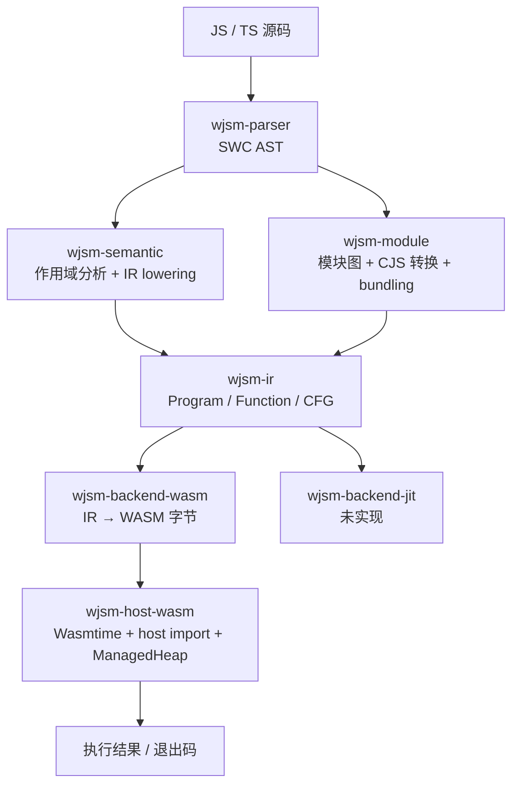

# 端到端架构

这一章给出从源码到执行结果的完整链路，以及每一段的 owner crate。后续各章都是这张图的展开。

## 主链路

横切层不在主链路上，但被主链路依赖：

| 层 | Crate | 职责 |
| --- | --- | --- |
| 宿主契约 | `wjsm-host` | `ExecContext`、`HeapContext`、`JsBackend` 等 trait |
| JS 语义算法 | `wjsm-builtins` | ECMAScript / WHATWG 算法，`<E: ExecContext>` 泛型 |
| 堆与 GC | `wjsm-gc` | `HandleTableV2`、`HeapAccessV2<M>`、mark-sweep / G1 / ZGC |
| 快照格式 | `wjsm-snapshot-format` | 启动快照的二进制布局与重定位 |
| 兼容 facade | `wjsm-runtime` | 只 re-export，不含实现 |

## 阶段边界

每个阶段的输入输出是明确的数据结构，不是隐式共享状态：

1. **parse**：源文本 → `swc_ast::Module`。语法模式按扩展名选择。
2. **lower**：AST → `wjsm_ir::Program`。两阶段进行，先预声明再 lower，保证 hoisting 与 TDZ。
3. **bundle**（多文件时）：入口 + 依赖图 → 单个 `Program`。
4. **compile**：`Program` → WASM 字节。
5. **execute**：WASM 字节 + `RuntimeOptions` → 副作用与退出码。

`wjsm build --stage <parse|lower|compile|execute>` 会在对应边界停下，这是验证某一段是否正确的首选手段。

> 

为什么阶段边界要这么严格？

>
> 流水线里每个阶段都有自己的「真理来源」：parse 的输出是 SWC AST，lower 的输出是 IR，compile 的输出是 WASM 字节。各阶段之间不通过「全局状态」或「共享内存」通信，只通过数据结构。
>
> 这意味着：
>
> - 想验证 lower 是否正确？dump 它的输出（IR），和 fixture 对比。
> - 想看 codegen 出了什么问题？看 dump-wat 输出的 WAT。
> - 想在 codegen 阶段诊断问题？不需要碰 IR 和 parser 层的代码——它们已经被验证过。
>
> 阶段之间的「可观察边界」是 wjsm 高效定位 bug 的基础。没有这些边界，bug 可能出现在任何地方，调试就退化为「读所有代码」。
>
> 实际项目里「不严格」的反面教材：很多执行环境把 parse、lowering、codegen 全部塞在一个大函数里，靠中间变量共享状态。短期写起来快，长期 debug 时几乎没办法。
>
> 

## 编译编排的 owner

CLI 不自己串联各阶段的细节。`compile_source` 与 `compile_source_with_debug` 位于 `wjsm-host-wasm`，它们内部依次调用 parser、semantic 和 backend。CLI 侧负责的是输入解析、配置合并和产物落盘。

## 后端边界

Wasm 与 Wasmtime 依赖只允许出现在 `wjsm-backend-wasm` 和 `wjsm-host-wasm`。这不是风格约定，而是 ADR 0011–0013 的硬约束：新后端只需实现 `HeapMemory`、`ExecContext` 与 `JsBackend`，即可复用全部语义算法与 GC。

## 相关章节

- [编译编排入口](../pipeline/orchestration.md)
- [Workspace crate 地图](crate-map.md)
- [多后端边界](../backend/multi-backend-boundary.md)
- 用户视角的同一张图见[面向使用者的架构概览](../../user/overview/architecture.md)
