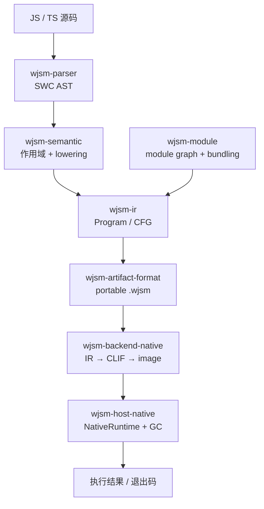

# 端到端架构

## 主链路

## 横切层

| 层 | Owner | 约束 |
| --- | --- | --- |
| semantic IR | `wjsm-ir` | 不知道 native pointer、Cranelift 或 host state |
| artifact | `wjsm-artifact-format` | canonical、bounded、可验证、跨平台，不含机器码 |
| native ABI | `wjsm-native-abi` | vmctx/call/root/source frame 与 symbol contract |
| JS 算法 | `wjsm-builtins` / `wjsm-host` | 后端无关，复用同步/异步语义算法 |
| heap/GC | `wjsm-gc` | 统一 ManagedHeap/HandleTableV2，无 dual heap |
| native host | `wjsm-host-native` | 唯一 runtime/scheduler/module/inspector owner |

## 阶段边界

1. parse：source → SWC AST；
2. lower：AST → verified `Program`；
3. bundle：module graph → Program + manifest；
4. artifact：IR/manifest → canonical `.wjsm`；
5. native：artifact → current-host CLIF/image；
6. execute：image + NativeRuntime → side effects/status。

Direct native code 不提供 Wasm sandbox。artifact verification、checked lowering、strict relocation、W^X 与 symbol allowlist 是受信 TCB，不等同于进程隔离。

## 权威来源

- [ADR 0014](../../../../adr/0014-direct-cranelift-portable-artifact.md)
- [Direct Cranelift 后端实现指南](../../../backend-implementation-guide.md)
- [Workspace crate 地图](crate-map.md)
