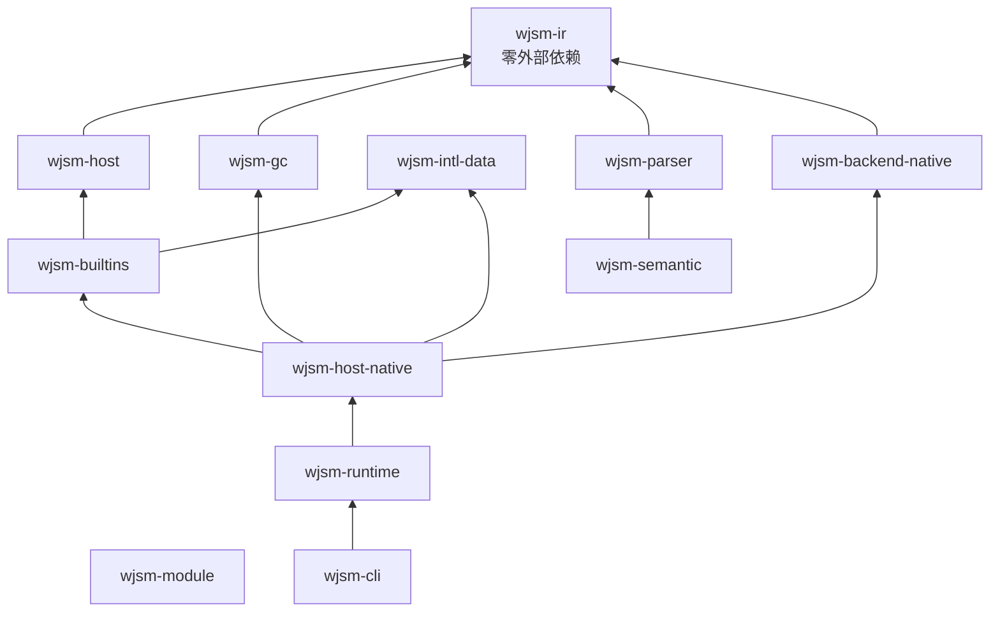

# 跨 crate 所有权与依赖边界

这一章说明依赖方向为什么是单向的，哪些边界不允许跨越，以及违反后会失去什么。

## 依赖方向

`wjsm-ir` 位于底部且没有外部依赖，因此可以被任何层引用而不会引入工具链负担。

## 不允许跨越的边界

ADR 0014 确立了三条硬边界：

1. **Cranelift 依赖只允许出现在 `wjsm-backend-native` 与 `wjsm-host-native`。** 任何其他 crate 出现 `cranelift-*` 依赖都是回归。
2. **`wjsm-builtins`、`wjsm-host`、`wjsm-gc`、`wjsm-module`、`wjsm-intl-data` 保持后端无关。** 它们只能依赖 `wjsm-ir` 与 `wjsm-host` 的抽象，不得知道执行后端是什么。国际化数据只经 `wjsm-intl-data` 进入二进制。

## 边界带来的能力

保持这些边界的直接收益是新后端的接入成本：实现 `HeapMemory` / `GrowableHeapMemory`、`ExecContext` 与 `JsBackend` 三组 trait，即可复用约 1.7 万行语义算法与整套 GC，无需重写 ECMAScript 语义。这是 ADR 0014 继承自 0013 的核心结论。

反过来，如果语义算法直接持有后端专有状态，它们就永久绑定特定执行引擎——这正是 ADR 0012 之前的状态，也是拆出 `wjsm-builtins` 的原因。

> 

这些边界如何用代码检查保证？

>
> 物理上没有自动化检查（不像 `cargo test` 那样跑过就放心）。但有几条「手工 grep」的检查可以快速验证：
>
> - `grep -r "cranelift" crates/wjsm-builtins/` 应该没结果。
> - `grep -r "cranelift" crates/wjsm-semantic/` 应该没结果。
>
> 这些是「一致性」检查，不是「正确性」检查——通过不证明绝对没问题，但不通过一定有问题。
> 实际工作里 PR review 时看到「在 `wjsm-builtins` 里 import cranelift 类型」会被立刻打回。这条边界靠社区维护，不靠工具。
>
> 

## 单一事实来源

同一事实只允许有一个 owner，其他位置引用而不复制：

| 事实 | Owner |
| --- | --- |
| CLI 参数模型 | `wjsm-cli/src/cli_args.rs` |
| 配置文件合并与优先级 | `wjsm-cli/src/cli_config.rs` |
| GC 算法选择 | `wjsm-host-native/src/lib.rs::NativeRuntimeConfig::from_environment` |
| 缓存目录 | 调用方传入的 `cache_dir`；CLI 只读 `WJSM_CACHE_DIR`，无默认目录 |
| NaN-boxing 标签 | `wjsm-ir/src/value.rs` |
| Root 帧布局 | `wjsm-native-abi` 的 `NativeRootFrame` |
| Node 内置模块清单 | `wjsm-module/src/builtin_modules.rs` |
| 全局名单 | `wjsm-semantic/src/builtins.rs::BUILTIN_GLOBALS` |
| CLDR/Unicode 数据 | `wjsm-intl-data` |

## 例外与理由

ADR 0014 列出四类不迁入 `wjsm-builtins` 的豁免，因为它们本质是后端职责而非 JS 语义：分配与 GC glue、I/O 桥（`fetch_http`、`streams_fetch_body`）、再入基础设施（`reentrant_async`）以及 bootstrap 全局装配。

## 相关章节

- [Workspace crate 地图](crate-map.md)
- [多后端边界](../backend/README.md)
- [多后端边界](../backend/README.md)
- [ADR 导航](../reference/adr-index.md)
