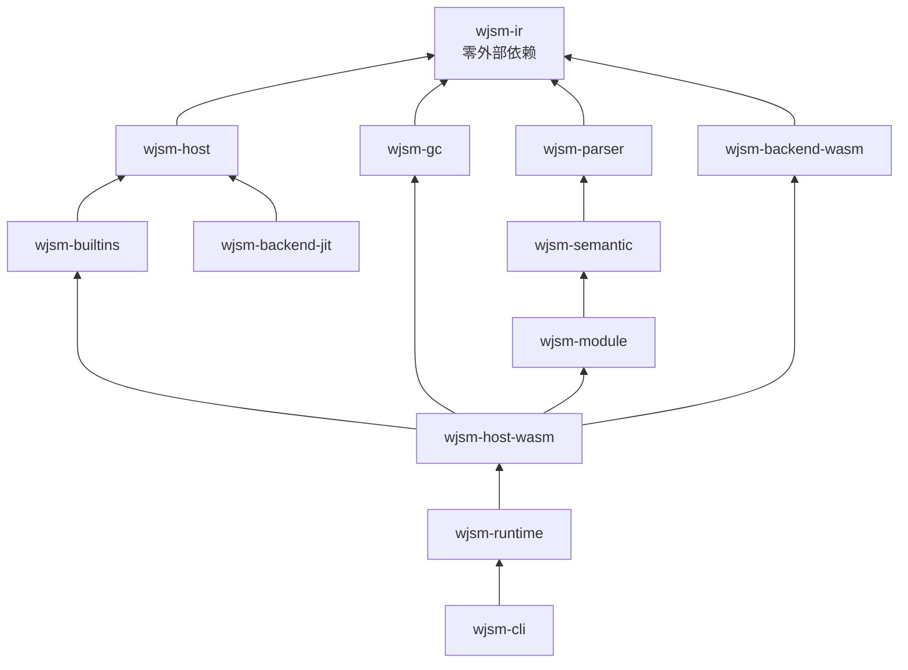

# 跨 crate 所有权与依赖边界

这一章说明依赖方向为什么是单向的，哪些边界不允许跨越，以及违反后会失去什么。

## 依赖方向

`wjsm-ir` 位于底部且没有外部依赖，因此可以被任何层引用而不会引入工具链负担。

## 不允许跨越的边界

ADR 0011–0013 确立了三条硬边界：

1. **Wasm 与 Wasmtime 依赖只允许出现在 `wjsm-backend-wasm` 与 `wjsm-host-wasm`。** 任何其他 crate 出现 `wasmtime` 或 `wasm-encoder` 依赖都是回归。
2. **`wjsm-builtins`、`wjsm-host`、`wjsm-gc`、`wjsm-module` 保持后端无关。** 它们只能依赖 `wjsm-ir` 与 `wjsm-host` 的抽象，不得知道执行后端是什么。
3. **`wjsm-runtime` 不承载实现。** 它是 facade，只做 re-export。

## 边界带来的能力

保持这些边界的直接收益是新后端的接入成本：实现 `HeapMemory` / `GrowableHeapMemory`、`ExecContext` 与 `JsBackend` 三组 trait，即可复用约 1.7 万行语义算法与整套 GC，无需重写 ECMAScript 语义。这是 ADR 0013 的核心结论。

反过来，如果语义算法直接持有 `Caller<RuntimeState>`，它们就永久绑定 Wasmtime——这正是 ADR 0012 之前的状态，也是拆出 `wjsm-builtins` 的原因。

## 单一事实来源

同一事实只允许有一个 owner，其他位置引用而不复制：

| 事实 | Owner |
| --- | --- |
| CLI 参数模型 | `wjsm-cli/src/cli_args.rs` |
| 配置文件合并与优先级 | `wjsm-cli/src/cli_config.rs` |
| GC 算法选择 | `wjsm-host-wasm/src/lib.rs::gc_algorithm_from_env` |
| 缓存目录解析 | `wjsm-host-wasm/src/runtime_startup.rs::module_cache_dir` |
| NaN-boxing 标签 | `wjsm-ir/src/value.rs` |
| 影子栈默认值 | `wjsm-ir/src/lib.rs` 的 `SHADOW_STACK_*` 常量 |
| Node 内置模块清单 | `wjsm-module/src/builtin_modules.rs` |
| 全局名单 | `wjsm-semantic/src/builtins.rs::BUILTIN_GLOBALS` |

## 例外与理由

ADR 0013 列出四类不迁入 `wjsm-builtins` 的豁免，因为它们本质是后端职责而非 JS 语义：分配与 GC glue、I/O 桥（`fetch_http`、`streams_fetch_body`）、再入基础设施（`reentrant_async`）以及 bootstrap 全局装配。

## 相关章节

- [Workspace crate 地图](crate-map.md)
- [Owner 与单一事实来源](../reference/owners-and-sources-of-truth.md)
- [多后端边界](../backend/multi-backend-boundary.md)
- [ADR 导航](../reference/adr-index.md)
