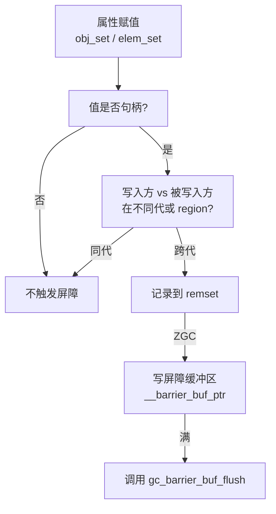

# 写屏障、读屏障与 Remset

GC 屏障维护跨代引用的一致性；remset 记录哪些 old 对象引用了 young 对象。`GenerationalZgc` 使用：

| 机制 | 用途 |
| --- | --- |
| 代际写屏障 | 记录跨代引用 |
| 着色指针读屏障 | 并发移动时转发过时指针 |
| Remset | young GC 扫描 old→young 边 |

## 为什么需要屏障

分代 GC 的基本假设是「young 对象很少引用 old 对象」。如果 old 对象引用 young 对象，young GC 只扫 young 区会漏掉这个引用。屏障在写入时记录跨代引用，让 young GC 能找到它。

ZGC 使用着色指针，屏障在读取时检查指针颜色，必要时转发到新地址。这避免了 STW 的对象移动。

## 写屏障流程

写屏障在属性赋值时触发。`__good_color` 和 `__barrier_buf_ptr` / `__barrier_buf_end` 是 ZGC 写屏障使用的 env global。屏障缓冲区满时调用宿主函数刷新。

## 读屏障

ZGC 的读屏障在读取对象字段时检查指针颜色。着色指针在高位编码 epoch 信息，读屏障据此判断指针是否需要转发。

读屏障的开销高于写屏障（读比写频繁），但 ZGC 通过它在并发移动对象时保持正确性。

## Remset

remset（remembered set）记录「哪些 old 对象引用了 young 对象」。young GC 扫描 remset 里的 old 对象，而不是全部 old 区。ZGC 分代版本结合着色指针、并发标记与 remset 记录跨代引用。

## 深入了解

- [ZGC 的着色指针与并发移动](zgc.md)
- [GC 不变量](configuration-and-invariants.md)
