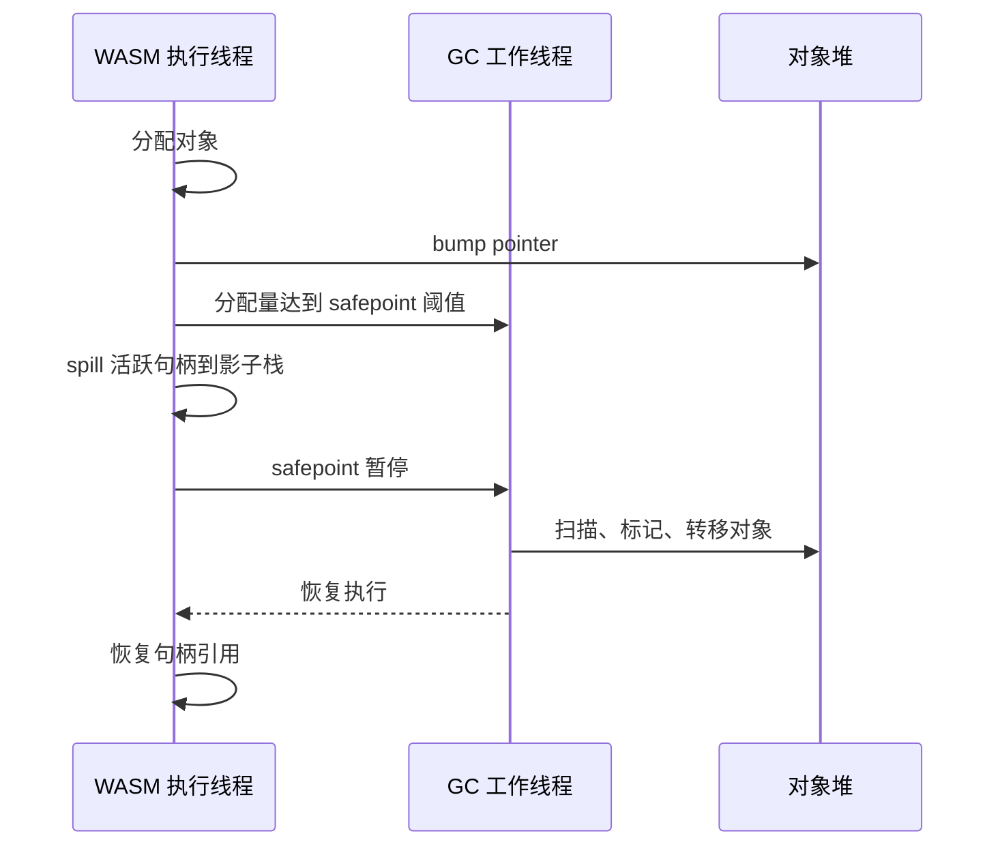

# 并发阶段、工作线程与 Pacing

ZGC 和 G1 的并发回收需要与 WASM 执行协调。这一章说明工作线程、safepoint 和 pacing 如何配合。

## 工作线程

ZGC 和 G1 的并发阶段使用工作线程（worker thread）。工作线程是宿主侧的 OS 线程，不是 WASM 线程。它们直接操作 shared memory64 对象堆，通过 atomics 指令同步。

WASM 执行线程与 GC 工作线程并发运行。WASM 线程在 safepoint 让出 CPU 时，工作线程可以推进标记或转移工作。

## Safepoint 协调



## Safepoint

safepoint 是 WASM 执行可以安全暂停的点。后端在分配 fast path 和循环回边插入 safepoint 检查（见[变量活跃性](../backend/liveness-slots-and-spills.md)）。

safepoint 时，WASM 线程把活跃句柄 spill 到影子栈，工作线程可以安全扫描。safepoint 退出后，WASM 线程继续执行。

## Pacing

pacing 控制 GC 工作的推进速度，避免堆增长过快导致 STW。`StepBudget` 记录工作量和截止时间：

```rust
pub struct StepBudget {
    pub work_bytes: usize,
    pub deadline: std::time::Instant,
}
```

分配率越高，pacing 推进越快。目标是让 GC 在堆满之前完成一个周期。

## 增量步进

`CycleKind::Step` 是增量 GC 的单步。每次分配触发一个 step，step 的工作量由 pacing 决定。

| 周期类型 | 说明 |
| --- | --- |
| `Full` | 完整 mark-sweep 周期 |
| `Young` | young GC（G1/ZGC） |
| `Mixed` | mixed GC（G1） |
| `ZgcCycle` | 完整 ZGC 周期 |
| `Step` | 增量步进 |

步进让长周期 GC 分散到多次分配中，避免单次长时间 STW。

## 深入了解

- [safepoint spill 的后端实现](../backend/liveness-slots-and-spills.md)
- [ZGC 的并发阶段划分](zgc.md)
- [G1 的暂停时间控制](g1.md)
