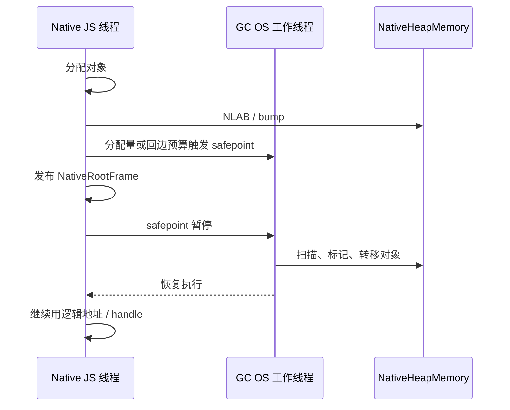

# 并发阶段、工作线程与 Pacing

ZGC 的并发回收需要与 native JS 执行协调。这一章说明工作线程、safepoint 和 pacing 如何配合。

## 工作线程

并发阶段使用宿主 OS 线程，不是独立的 JS agent，也不是 WASM 线程。`NativeGc` 构造 `GenerationalZgc` 时按 `available_parallelism` 取 worker 数（至少 1）。这些线程直接操作 `NativeHeapMemory`，通过宿主原子操作同步。

Mutator 是执行用户 JS 的 native 线程（`NativeRuntime` 的 owner thread）。它在 safepoint 暂停时，GC worker 可以推进标记或转移。

## Safepoint 协调



## Safepoint

safepoint 是 native mutator 可以安全暂停的点。后端在分配 fast path 和循环回边插入检查：回边从 `NativeVmContext::stack_budget_bytes` 扣除 `COOPERATIVE_POLL_STEP_BYTES`，耗尽后调用 `NativeRuntimeOp::CooperativePoll`（重置预算，并做 inspector / GC / 外部事件轮询）。

暂停时 generated code 发布 `NativeRootFrame`（`slots` + bitmap）。collector 只读 bitmap 置位的槽。

## Pacing

pacing 控制 GC 工作的推进速度，避免堆增长过快导致长时间 STW。`StepBudget` 记录工作量和截止时间：

```rust
pub struct StepBudget {
    pub work_bytes: usize,
    pub deadline: std::time::Instant,
}
```

分配率越高，pacing 推进越快。目标是让 GC 在堆满之前完成一个周期。

## 增量步进

`CycleKind::Step` 是增量 GC 的单步。每次分配触发一个 step，step 的工作量由 pacing 决定。

| 周期类型 | 说明 |
| --- | --- |
| `Full` | 完整堆回收周期 |
| `Young` | young GC |
| `Mixed` | mixed GC（old 区部分回收） |
| `ZgcCycle` | 完整 ZGC 周期 |
| `Step` | 增量步进 |

步进让长周期 GC 分散到多次分配中，避免单次长时间 STW。

## 深入了解

- [safepoint spill 的后端实现](../backend/liveness-slots-and-spills.md)
- [ZGC 的并发阶段划分](zgc.md)
