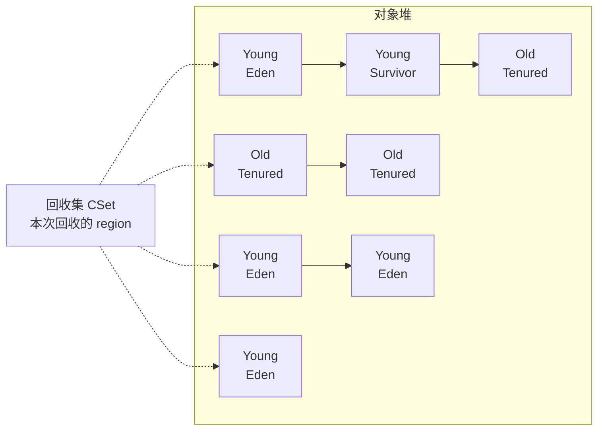

# G1

G1 是分代 + 分区回收器，目标是控制暂停时间。它把堆划分成固定大小的 region（默认 2 MiB），只回收回收集（CSet）内的 region，不扫描整个堆。

## Region 模型

每个 region 独立记录分代归属和回收成本估计。分配优先在 young region 进行，Eden 区满时触发 young GC。

## GC 周期

| 阶段 | 类型 | 说明 |
| --- | --- | --- |
| Young GC | STW | 回收 Eden + Survivor；存活对象晋升到 old region 或另一 survivor |
| 并发标记 | 并发 | 标记整个堆的存活对象，不暂停执行 |
| 再标记 | STW | 处理并发标记期间的 SATB（Snapshot-At-The-Beginning）缓冲区 |
| Mixed GC | STW | 回收全部 young region + 部分 old region，治理 old 区碎片 |
| Full GC | STW | 退化为 mark-sweep 式全堆回收，concurrent mode failure 时触发 |

Young GC 只扫 young region + remset 记录的跨代引用，暂停时间与 young 区大小相关，不受整个堆大小影响。

## 暂停时间控制

`crates/wjsm-gc/src/g1.rs` 定义 `G1Collector` 结构。`--gc-g1-max-pause-ms` 设定暂停时间目标（默认 200 ms）。G1 记录每个 region 的回收成本估计（活对象占比 × 历史耗时），在目标时间内优先选择成本最高的 region 加入 CSet。

## 写屏障

G1 使用 SATB 写屏障。写入 old 对象引用 young 对象时，记录到 old region 的 remset（`G1RemSet`）。young GC 扫描 CSet 内对象 + CSet 外对象在 remset 里记录的引用。

SATB 屏障在并发标记期间记录被覆盖的引用，保证 concurrent marking 不会漏掉标记开始时存活的对象。

## 晋升与失败

Young GC 中存活的对象尝试晋升到当前 old region。如果 old 区没有足够空间，触发并发标记或 mixed GC。如果标记来不及完成导致 old 区全部占满，退化为 Full GC。

## 深入了解

- [写屏障与 remset 的机制](barriers-and-remset.md)
- [Mark-Sweep 作为 G1 的参考实现](mark-sweep.md)
- [ZGC 的并发移动对比](zgc.md)
- [GC 选择逻辑与配置项](configuration-and-invariants.md)
