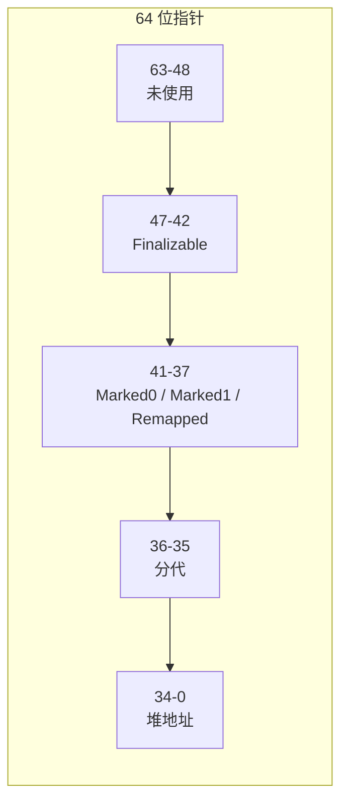

# Generational ZGC

ZGC 是并发移动回收器，暂停时间与堆大小无关。核心机制是着色指针加读屏障：对象移动时更新指针，读者通过屏障自动转发，不需要 STW。

## 着色指针

`crates/wjsm-gc/src/heap/colored_ptr.rs` 定义着色指针操作。高位编码 GC 状态：

- `Marked0` / `Marked1`：标记位，交替使用。
- `Remapped`：指针指向最新地址。
- `Finalizable`：对象在本次 GC 中首次标记（用于 FinalizationRegistry）。
- 分代位：标识 young 或 old。

读屏障检查指针颜色，如果指针过时（指向旧地址），转发到新地址并更新。

## 并发阶段

| 阶段 | 暂停 | 工作 |
| --- | --- | --- |
| 初始标记 | STW | 从根集出发标记直接可达对象 |
| 并发标记 | 并发 | 工作线程遍历对象图，标记所有可达对象 |
| 再标记 | STW | 处理标记结束时的 SATB 缓冲区 |
| 并发转移 | 并发 | 移动对象，更新前向指针 |
| 重映射 | 并发 | 修复过时指针 |

STW 阶段只处理根集，暂停时间与根集大小相关，与堆大小无关。

## 分代

Generational ZGC 把 young 对象和 old 对象分开管理。young GC 只扫 young 区，频率高、成本低。old GC 处理整个堆，频率低。

分代引入了跨代引用问题，通过写屏障（`generational_barrier_for_young`）和 remset 解决（见[屏障与 remset](barriers-and-remset.md)）。

## 屏障缓冲区

ZGC 写屏障使用 `__barrier_buf_ptr` / `__barrier_buf_end` 两个 env global 管理缓冲区。屏障满时调用宿主函数 `gc_barrier_buf_flush` 刷新。着色指针的 `__good_color` global 缓存当前 epoch 的有效颜色值，读屏障先检查该值再决定是否转发。

## 生产回收器

wjsm 固定使用并发分代 ZGC（`GenerationalZgc`）；无 `--gc` 或 `WJSM_GC` 选择面。配置与不变量见 [GC 选择与配置](configuration-and-invariants.md)。

## 深入了解

- [着色指针与读屏障的配合](barriers-and-remset.md)
- [用户侧的 GC 配置](../../user/configuration/gc.md)
