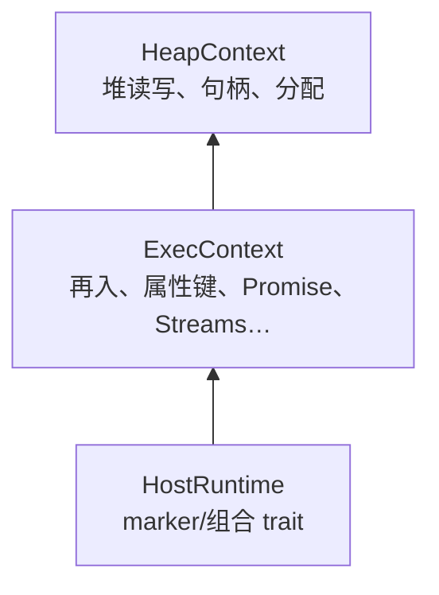

# ExecContext 与 Builtins 的解耦设计

`wjsm-host` 定义后端无关的 trait 契约，`wjsm-builtins` 在这些 trait 上实现 ECMAScript 语义算法。这一章说明解耦设计的意图和边界。

## 为什么拆开

ADR 0012 把 builtins 从 host runtime 中拆出，核心动机是：语义算法不应该知道执行后端是什么。

在拆分之前，`wjsm-host-native` 同时持有 Cranelift 类型（`NativeVmContext`）和 ECMAScript 算法（`Array.prototype.map` 的实现等）。这意味着如果要换后端，每个算法都要重写以适应新后端的类型系统。

拆分后，`wjsm-builtins` 只依赖 `ExecContext` trait，不依赖任何具体后端。新后端实现 trait，算法代码零改动即可复用。

## trait 层次

`HeapContext` 是最底层 trait，定义堆读写和对象分配。`ExecContext` 是它的超集，补齐再入回调、属性键、Promise、枚举器等约 330 个方法。

## 泛型单态化

`wjsm-builtins` 的全部算法以 `<E: ExecContext>` 泛型实例化。编译器为每个具体后端生成专门的代码，没有 vtable 查表，调用是直接的函数调用。

这是 ADR 0012 的核心收益：语义算法不绑定任何具体后端，同时也不付出运行时间接调用的代价。

## 数据类型

`wjsm-host` 同时定义了跨后端共享的数据结构：

- `Handle`、`Value`：句柄与 NaN-box 值。
- `JsonValue`：JSON 往返。
- `ProxyEntry`、`ClosureEntry`、`BoundEntry`、`PromiseEntry`：builtins 可见的投影。
- Streams 相关枚举。

这些类型让 builtins 可以操作具体后端的状态而不需要知道后端内部布局。

## 深入了解

- [Host 能力 Trait](host-traits.md)
- [核心 JavaScript Builtins](javascript-builtins.md)
- [多后端边界与 JsBackend 契约](../backend/multi-backend-boundary.md)
