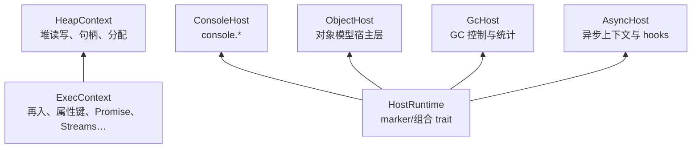

# Host 能力 Trait

`wjsm-host` 定义后端必须实现的 trait 契约。这一章说明 trait 层次与设计意图。

## trait 层次

`HostRuntime` 是 marker trait，对「同时实现全部 sub-trait」的类型有 blanket impl。它本身没有方法，存在意义是作为 facade 的公开类型约束。新后端不需要实现它——真正要实现的是 `ExecContext` 与 `JsBackend`。

## HeapContext

`HeapContext` 是最底层 trait，定义堆读写、句柄操作和对象分配。`ExecContext` 是它的超集，补齐再入回调、属性键、Promise、枚举器等 builtins 能力。

拆分理由：一些场景只需要堆操作（如 support module 的 helper body），不需要完整的 `ExecContext`。分层让这些场景的实现更轻。

## ExecContext 的规模

`ExecContext` 有约 330 个方法，按域组织：再入控制、属性键构造与比较、对象/数组/集合算法、Promise/Proxy/Reflect、字符串与正则、TypedArray 与 ArrayBuffer、Date、JSON、Streams、Fetch、定时器、async hooks、Inspector 等。

每个方法对应一个 Builtin variant 或一组宿主操作。`wjsm-builtins` 的全部算法以 `<E: ExecContext>` 泛型实例化，编译期单态化，零 vtable 开销。这是 ADR 0012 的核心：语义算法不绑定任何具体后端。

## 后端无关的数据类型

`wjsm-host` 同时定义了跨后端共享的数据结构：

- `Handle`、`Value`：句柄与 NaN-box 值。
- `JsonValue`：JSON 往返。
- `ProxyEntry`、`ClosureEntry`、`BoundEntry`、`PromiseEntry`：builtins 可见投影。
- `ReadableStreamByobRequestMethodKind` 等 Streams 相关枚举。

这些类型让 builtins 可以操作具体后端的状态而不需要知道后端内部布局。

## 深入了解

- [ExecContext 与 Builtins 的解耦设计](exec-context-and-builtins.md)
- [wjsm-builtins crate 的组织方式](../runtime-features/node-builtins.md)
- [多后端边界与 JsBackend 契约](../backend/multi-backend-boundary.md)
