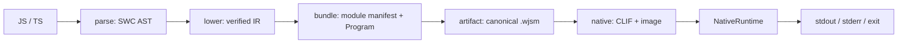

# 编译与执行流水线

阶段之间只交接明确数据：AST、`Program`、`ModuleManifest`、`PortableArtifact`、`CompiledImage`。CLI 负责输入/config/输出编排；各 owner 负责自己的验证和生命周期。

## 阶段与诊断出口

| 阶段 | 输出 | 诊断命令 |
| --- | --- | --- |
| parse | SWC AST | `dump-ast` |
| lower | semantic IR | `dump-ir` |
| bundle | Program + module manifest | `dump-ir --root ...` |
| artifact | canonical `.wjsm` | `build` / `validate` |
| native codegen | CLIF / current-host image | `dump-clif` / `disasm` |
| execute | observable output/status | `run` / fixtures |

`run` 从 source 或 `.wjsm` 输入开始，artifact 经过 bounded decode/verification 后才进入 native compiler/runtime。native cache 是 image 的派生加速数据，不改变 artifact source of truth。

## 失败定位

先用 `dump-ast`、`dump-ir`、`dump-clif` 找到第一个不一致的边界，再检查 image loader/cache 或 `NativeRuntime`。不要用临时生产日志掩盖 owning layer 的错误。

## 相关 owner

- parser/semantic/module：`wjsm-parser`、`wjsm-semantic`、`wjsm-module`；
- artifact：`wjsm-artifact-format`；
- CLIF/image：`wjsm-backend-native`；
- runtime/host：`wjsm-host-native`、`wjsm-builtins`、`wjsm-host`；
- heap/GC：`wjsm-gc`。
