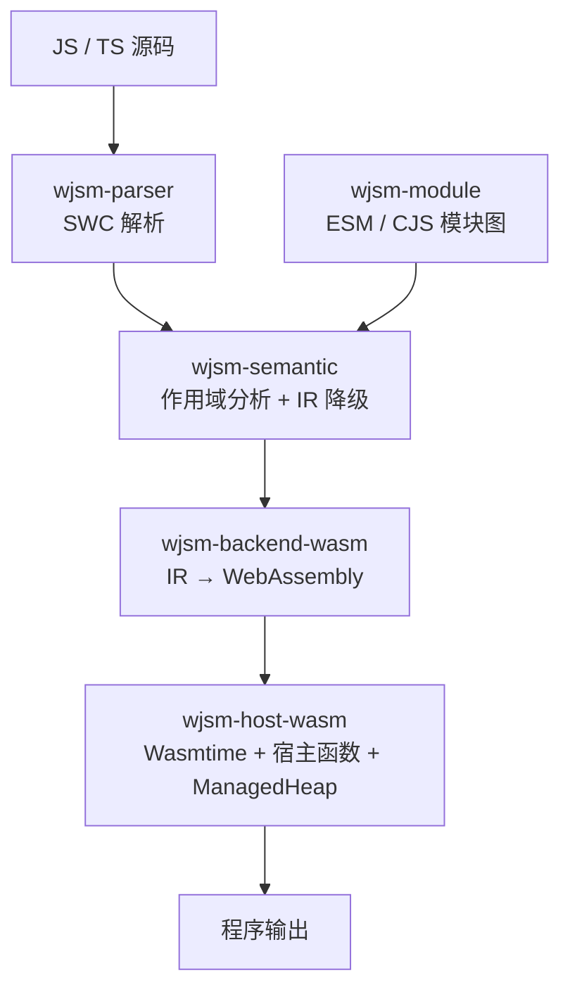

# 面向使用者的架构概览

这章的目的只有一个：让你在报错信息、`--time` 输出和手册后文里看到组件名时知道它负责什么。实现层面的依赖方向见内部手册。

## 数据流

多文件项目会先经过 `wjsm-module` 构建模块图并 bundle 成单个 IR Program，再走同一条编译路径。

## 各组件的可观察职责

| 组件 | 你会在什么时候遇到它 |
| --- | --- |
| `wjsm-parser` | 语法错误。诊断带文件名、行列和源码片段 |
| `wjsm-semantic` | 早期错误（重复声明、TDZ、非法 `await`）和 `dump-ir` 的输出 |
| `wjsm-module` | 模块解析失败、找不到包、条件导出没命中 |
| `wjsm-backend-wasm` | `dump-wat` 的输出、`.wasm` 体积、编译阶段的内部错误 |
| `wjsm-host-wasm` | 运行时错误、`console` 输出、GC 行为、Inspector 连接 |
| `wjsm-cli` | 参数解析、配置文件合并、`--time` / `--stats` 报告 |

其余 crate 你一般不会直接遇到：`wjsm-ir` 定义 IR 数据结构，`wjsm-host` 定义宿主契约，`wjsm-builtins` 实现与后端无关的语义算法，`wjsm-gc` 提供 GC 算法，`wjsm-runtime` 是对外的 facade。

## 两块内存

运行时有两块相互独立的线性内存，`--max-heap-size` 和 `--shadow-stack-max` 分别对应它们：

- **对象堆（ManagedHeap）**：所有 JavaScript 对象、数组、字符串、Promise 都在这里，由所选 GC 算法管理。
- **影子栈（shadow stack）**：`env.__shadow_memory`，用于传递变长参数和 GC safepoint 溢出。冷启动 64 KiB，按需增长，软上限默认 16 MiB。

两者上限分开配置，调错了会看到不相干的失败，参见[堆、影子栈与内存预留](../configuration/memory.md)。

## 深入了解

- [端到端架构](../../internals/foundations/architecture.md)：各 crate 的依赖方向与数据交接点。
- [Workspace crate 地图](../../internals/foundations/crate-map.md)：每个 crate 的职责边界和公共 API。
- [ManagedHeap 架构](../../internals/gc/managed-heap.md)：统一对象堆的组织方式。
