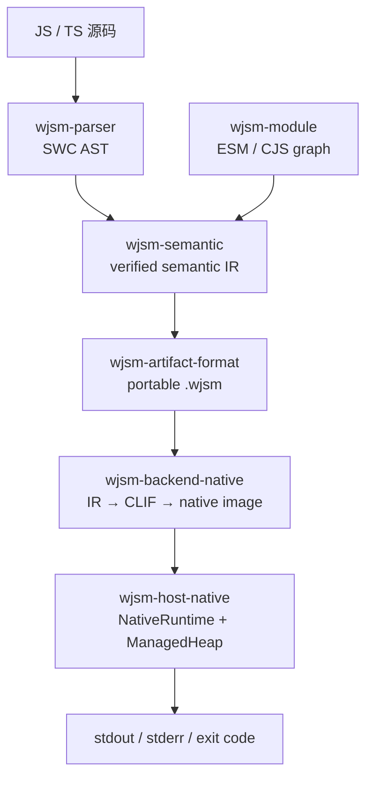

# 架构与执行模型

## 数据流

多文件项目先由 `wjsm-module` 构建依赖图和 portable manifest，再进入相同的 artifact/native 路径。`.wjsm` 只保存 target-independent semantic IR 与 module/source metadata，不保存机器码、宿主 pointer 或 native relocation。

## 编译在前，执行在后

`wjsm run app.ts` 依次完成：

1. 解析源码；
2. 作用域分析、early error 与 semantic lowering；
3. 构造并验证 portable artifact；
4. 磁盘缓存可用时（默认回落 XDG/HOME）查 native cache；被禁用或 miss 时由当前宿主把 IR 直接编译为 CLIF/native image；
5. `NativeRuntime` 调用入口并排空 Promise、微任务与外部事件。

解析与 early error 在执行前完成，因此失败的程序不会产生先行副作用。

## 值、对象与 GC

JavaScript 值使用固定宽度 NaN-boxing。对象、数组、字符串与 Promise 存在统一 ManagedHeap 中；值保存 stable handle，而不是可跨 safepoint 的 raw address。每个 agent 拥有独立 heap、`GenerationalZgc` collector、scheduler 与 runtime tables。

## 平台与安全

当前 production capability 只承诺 x86_64 Linux 与 x86_64 Windows。不支持的宿主在 native compiler 初始化时 fail-closed，不切换到另一 backend。

Direct native code 不提供进程内 sandbox。artifact verifier、checked lowering、strict relocation、symbol allowlist 与 W^X 是受信编译/加载边界；运行不受信任代码必须使用独立 OS process、权限隔离和资源限制。

## 深入了解

- [端到端架构](../../internals/foundations/architecture.md)
- [编译与执行流水线](../../internals/pipeline/index.html)
- [跨 crate 所有权与依赖边界](../../internals/foundations/ownership-and-dependencies.md)
