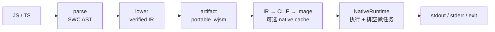

# 执行模型

## 一次 `wjsm run` 发生了什么

对应阶段：

1. **parse** — SWC 把源码解析为 AST；
2. **lower** — 作用域分析、early error 与 semantic lowering，产出 verified `Program`；
3. **artifact 构造** — IR 与 module/source metadata 封装为 canonical `.wjsm`，经 bounded decode 与 verifier 校验；
4. **native codegen** — 磁盘缓存可用时（默认回落 XDG/HOME，`WJSM_CACHE_DIR` 可覆盖）先查 `${cache_dir}/*.wnat`，命中则加载 image，miss 则编译并写入该目录；缓存被禁用时每次从 IR 编译；
5. **execute** — `NativeRuntime` 调用入口，排空 Promise、微任务与外部事件，产出可观察结果与退出码。

`wjsm build app.ts -o app.wjsm` 只完成前 3 步；`wjsm run app.wjsm` 从第 4 步开始。两条路径在 native codegen 处汇合。

## 失败不产生先行副作用

解析与 early error 全部在执行前完成。语法错误、重复声明、TDZ 违规、未解析导入都会在 native codegen 之前被拒绝——程序不会先打印一行再崩溃。这使得 `wjsm check` 与 `wjsm run` 在错误定位上行为一致：第一个被拒的阶段就是失败点。

## 多文件项目

多文件项目先由 `wjsm-module` 构建依赖图（ESM / CJS），解析条件导出与 `node_modules`，产出 portable manifest，再进入相同的 artifact/native 路径。`--root <DIR>` 指定模块解析根目录；bundling 把依赖图折叠成单个 `Program` + manifest 写入 `.wjsm`。

## `.wjsm` 制品

`.wjsm` 是 source of truth，只包含：

- target-independent semantic IR；
- module/source metadata（含 manifest）；
- 可选 source metadata。

它不保存机器码、宿主 pointer 或 native relocation。Cranelift object、relocation、可执行 image 与 native cache 都是当前宿主私有派生数据——同一份 `.wjsm` 可以拿到另一个受支持宿主上直接 `run`。磁盘缓存可用时（默认回落 XDG/HOME），首次编译的 native image 会写入该宿主的磁盘缓存。

## 值、对象与 GC

- **NaN-boxing**。JavaScript 值使用固定宽度编码，指针与双精度浮点共用同一字宽。
- **统一 ManagedHeap**。对象、数组、字符串、Promise 等分配在同一堆中，值保存 stable handle，而不是可跨 safepoint 的 raw address。
- **每 agent 独立 heap**。每个 agent 拥有独立 heap、`GenerationalZgc` collector、scheduler 与 runtime tables；`worker_threads` 启动的子 agent 不共享父 heap。

## 深入了解

- [编译与执行流水线的阶段边界](../../internals/pipeline/README.md)
- [面向使用者的架构概览](architecture.md)
- [端到端架构与 crate 边界](../../internals/foundations/architecture.md)
